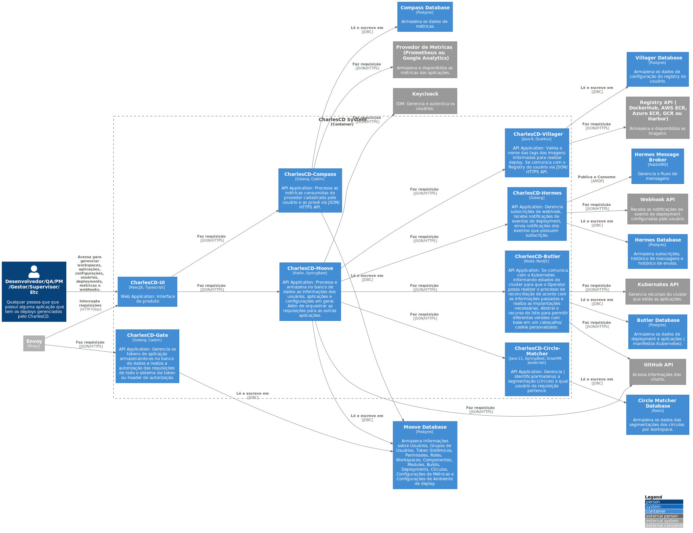

# C2 - Container

Nesse nível mostramos de maneira mais detalhada o sistema descrevendo os seus containers (Não confundir com o Docker) e como eles se comunicam/interagem. Nesse nível é dado ênfase na arquitetura e tecnologias utilizadas. A ideia é mostrar como o sistema é de forma macro. Um container pode ser uma aplicação web, um database, um sistema de arquivos, etc.

