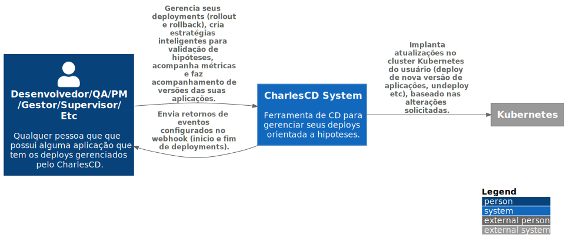

# C1 -  Context

É o primeiro nível do nosso desenho. A ideia é mostrar as interações de forma macro, sem muitos detalhes, dando enfoque às comunicações e dependências entre sistemas e usuários que compõem e interagem com o software.

Nesse nível contextualizamos  de forma macro como o CharlesCD interage com o Kubernetes e permite que o usuário possa gerenciar seus deploys utilizando uma série de recursos como métricas, hipoteses e webhooks. Onde:

- **Usuário:** Qualquer pessoa que possui uma aplicação que tem os deploys gerenciados pelo CharlesCD. Seja ela um desenvolvedor, gestor, QA, PM, etc.

- **Sistema CharlesCD**: O CharlesCD é uma ferramenta de deploy continuo orientada a hipoteses que permite o gerenciamento dos deploys de aplições web e backend. Ele permite o gerenciamento dos deploys (rollout e rollback), cria estratégias inteligentes para validação de hipóteses, colhe e observa métricas e faz acompanhamento de versões das suas aplicações. Além disse ele envia informações de eventos (previamente configurados) via webhooks. 
O CharlesCD interage diretamente com o Kubernetes, solicitando a implantação de atualizações no cluster do usuário.

- **Kubernetes:** Orquestra os containers das aplicações.

