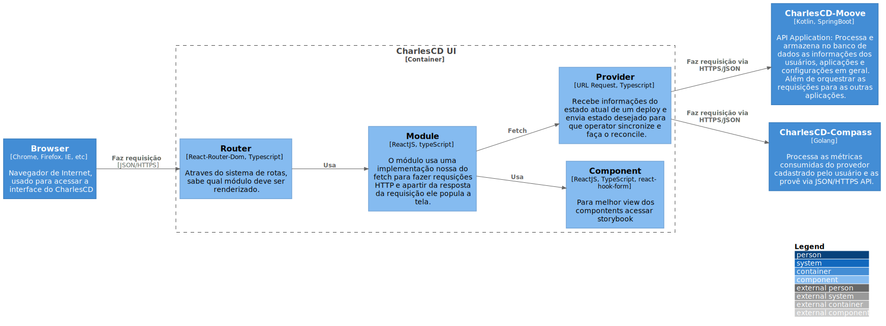

# UI

`/C3 -  Component/UI`

* [C4Model](/docs/README.md)
  * [C1 -  Context](/docs/C1%20-%20%20Context/README.md)
  * [C2 - Container](/docs/C2%20-%20Container/README.md)
  * [C3 -  Component](/docs/C3%20-%20%20Component/README.md)
    * [Butler](/docs/C3%20-%20%20Component/Butler/README.md)
    * [Circle-Matcher](/docs/C3%20-%20%20Component/Circle-Matcher/README.md)
    * [Compass](/docs/C3%20-%20%20Component/Compass/README.md)
    * [Gate](/docs/C3%20-%20%20Component/Gate/README.md)
    * [Hermes](/docs/C3%20-%20%20Component/Hermes/README.md)
    * [Moove](/docs/C3%20-%20%20Component/Moove/README.md)
    * [**UI**](/docs/C3%20-%20%20Component/UI/README.md)
    * [Villager](/docs/C3%20-%20%20Component/Villager/README.md)

---

[C3 -  Component (up)](/docs/C3%20-%20%20Component/README.md)

---

Frontend service in ReactJS, it provides a friendly-user interface for all CharlesCD features. It was created to simplify hypotheses tests and circles deployments. 

