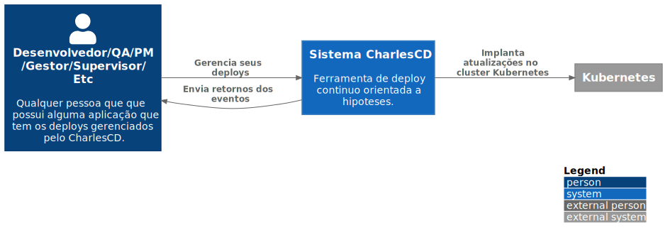

# C1 -  Context

# **C1: Context**
É o primeiro nível do desenho. A ideia é mostrar as interações do projeto de forma macro, sem muitos detalhes, focando nas comunicações e dependências entre sistemas e usuários que compõem e interagem com o software.

Nesse nível contextualizamos de forma macro como o CharlesCD interage com o Kubernetes e permite que o usuário possa gerenciar seus deploys utilizando uma série de recursos como métricas, hipóteses e webhooks. Veja abaixo: 

### **Usuário** 
- Qualquer pessoa que possui uma aplicação com os deploys gerenciados pelo CharlesCD. Pode ser um desenvolvedor, gestor, QA, PM, etc.

### **Sistema CharlesCD**
O CharlesCD é uma ferramenta de deploy contínuo orientada a hipóteses que:
    - Permite o gerenciamento dos deploys de aplicações web e backend.
    - Permite o gerenciamento dos deploys rollout e rollback.
    - Cria estratégias inteligentes para validação de hipóteses.
    - Colhe e observa métricas. 
    - Faz o acompanhamento de versões das suas aplicações. 
    - Envia informações de eventos (previamente configurados) via webhooks. 

### **Kubernetes:** 
- Orquestra os containers das aplicações.

