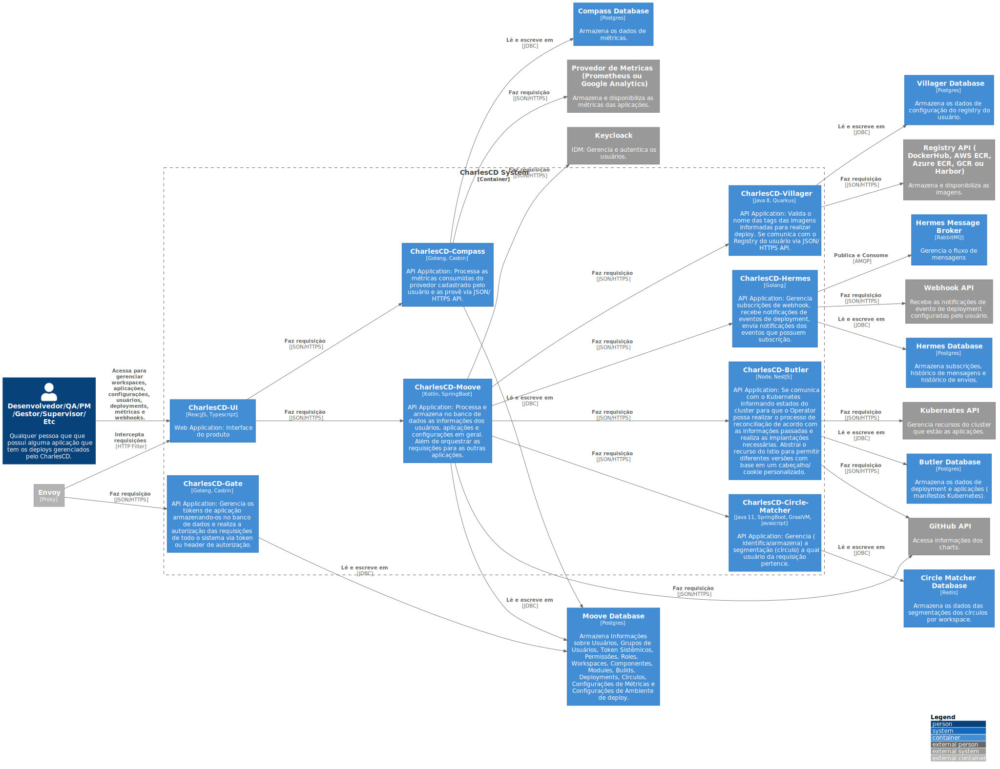

# C2 - Container

`/C2 - Container`

* [C4Model](/docs/README.md)
  * [C1 -  Context](/docs/C1%20-%20%20Context/README.md)
  * [**C2 - Container**](/docs/C2%20-%20Container/README.md)
  * [C3 -  Component](/docs/C3%20-%20%20Component/README.md)
    * [Butler](/docs/C3%20-%20%20Component/Butler/README.md)
    * [Circle-Matcher](/docs/C3%20-%20%20Component/Circle-Matcher/README.md)
    * [Compass](/docs/C3%20-%20%20Component/Compass/README.md)
    * [Gate](/docs/C3%20-%20%20Component/Gate/README.md)
    * [Hermes](/docs/C3%20-%20%20Component/Hermes/README.md)
    * [Moove](/docs/C3%20-%20%20Component/Moove/README.md)
    * [UI](/docs/C3%20-%20%20Component/UI/README.md)
    * [Villager](/docs/C3%20-%20%20Component/Villager/README.md)

---

[C4Model (up)](/docs/README.md)

---

Nesse nível mostramos de maneira mais detalhada o sistema descrevendo os seus containers (Não confundir com o Docker) e como eles se comunicam/interagem. Nesse nível é dado ênfase na arquitetura e tecnologias utilizadas. A ideia é mostrar como o sistema é de forma macro. Um container pode ser uma aplicação web, um database, um sistema de arquivos, etc.

