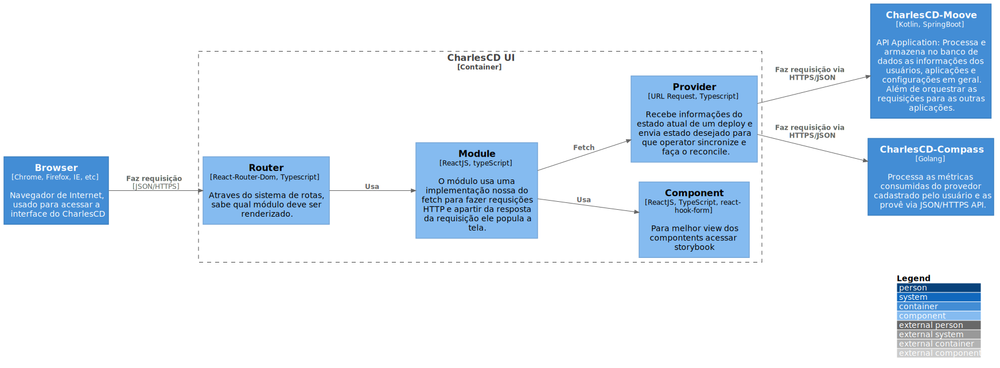

# UI

Serviço frontend em ReactJS, responsável por prover uma interface de fácil usabilidade para todas as features fornecida pelo CharlesCD, no intuito de simplificar testes de hipóteses e circle deployment.

